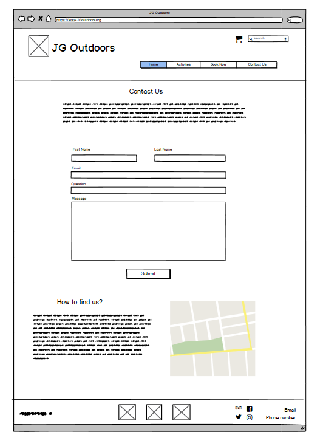

# JG Outdoors

This is my Second project for the Code Institute Full Stack Development diploma. I have developed a website for a made up activity centre. On this website I have written my own booking program from scratch and have used the email.js api to make a working contact form. 

## UX

This project is designed to be used by potential customers so that they can find out information on all the activities that are on offer and then booked an activity on a certain date and time slot. It can also be used by the centre  to easily track what bookings that they have on each day.

### User Stories

- A customer looking to find out more information on the activities available and book an activity
- The centre to find out what time slot have been booked and create a time table for each day easily
- A customer looking for more information on the centre who wants an easy way to get in contact. 
- A software developer looking to see my ability to write javascript

### Mockups

The web site consists of ten pages each containing different information and links to booking with two pages heavily dependent on javascript. These two pages have purpose built programs to allow the user to book sessions easily and get in contact with the centre.
##### These programs were:
- Booking system which saves the date and time slot to the local storage using a shopping cart. This system doesn’t allow people to double book a time slot.
- A shopping cart which saves the activity object to session storage and gives the array of objects a gui which can be accessed from all pages.
- A contact form which emails the centre with any questions that the customer may have.

### Wireframing

I drew up the first plan of the website on balsamiq. This was a simple drawing with just a basic plan of the website and program, a lot of the ideas from this drawing have been scraped as I wanted to keep the website simple.

[PDF of Balsamiq design](assets/pdf/milestone2-bal.pdf)

[Balsamiq File](assets/files/Milestone2.bmpr)

I then created a second design using adobe XD which included the colours and images for the project as well as the fonts I would use and the pixel measurements for spacing and sizing. Adobe XD allowed me to create a detailed mobile and desktop design. I mostly stuck to this plan however a changed a few small things so they would work better in the browser.

[PDF of XD design](assets/pdf/milestone2-xd.pdf)

[Adobe XD File](assets/files/Milestone2.xd)

## Features

### Existing Features

- **Navagtion Bar** – Allows intuitive navigation around the different pages of my web site.
- **Drop down** – Allows access to subpages of the web site easily.
- **Footer** – This contains links to my social media accounts as well as email so people can get quick access to my contents on each page.
- **Contact form** – A page that makes the process of contacting me accessible from the webpage.
- **Responsive** – This ensures that the website works on all screen sizes.
- **Shopping Cart** - Makes it easy to see the different activities booked and total price of all bookings
- **Booking System** - Makes it easy to see when there as time slots free and to book the slot that you want so that no one else can
- **Local Storage** - used to store the bookings so that the booking program can pull the dates and shoe to user weather the splot is free or not
- **Session Storage** - allow the cart items to be stored so that the cart can be accessed across the whole page

### Design Colours

I decided to base my colours on the background image so that the whole website would stay with a outdoors theme and give the user an idea of what the website is before reading anything.

**Colour Scheme**

- `#4087B4` - Header background
- `#707070` - Borders and Footer text
- `#EAF2E4` - Content Background
- `#2C3D36` - Footer Background and Activity text
- `#629460` - Activity Book Button Background
- `#dcca98` - Activity Select Background and Modal Background
- `#ff0000` - Booked Slot
- `#FD6A02` - Idle Slot
- `#008000` - Available Slot

### Fonts

I acquired the font from Google fonts. I used Sans source Pro for the headings and titles as I believe this was appropriate to the Professional theme of the website. Roboto compliments Poppins so I have used this for the contents.

`@import url('https://fonts.googleapis.com/css2?family=Roboto:wght@400;500;700&family=Source+Sans+Pro:wght@400;600;700;900&display=swap');`

### Images

I mostly got my images from 2 websites https://www.marwellactivitycentre.co.uk/ and https://www.avontyrrell.org.uk/ . I also got all my text content from these websites as I had permission to use this content for the managers; Graham Marks and Matt Prince . the few images I didnt get from these websites I got from google images after checking that they were royalty free images.

### Features Left to Implement

- Add a full week to booking system when in desktop mode 
- Would write python server to store data
- Add Google Maps API to add a locations on contact page
- Make booking system email centre when booking was made 

## Technologies Used

- [HTML5](https://en.wikipedia.org/wiki/HTML5) – Used to create the structure and content of the site
- [CSS3](https://en.wikipedia.org/wiki/Cascading_Style_Sheets#CSS_3) – Used to add styling and animations
- [Bootstrap](https://getbootstrap.com/) – Used to add layout and responsiveness to elements
- [Font Awesome](https://fontawesome.com/) – Used to add icons and link to social media
- [Google Fonts](https://fonts.google.com/) – Supplies the fonts for the websites
- [JavaScript](https://en.wikipedia.org/wiki/JavaScript) - Language used to write booking system cart
- [Local and Session Storage](https://developer.mozilla.org/en-US/docs/Web/API/Window/localStorage) - Used to store data
- [jQuery](https://en.wikipedia.org/wiki/JQueryhttps://en.wikipedia.org/wiki/JQuery) – Used for DOM manipulation
- [Email.js](https://www.emailjs.com/) - used to make contact form functional
- [GitPod](https://gitpod.io/) – The IDE used for the project
- [Git](https://en.wikipedia.org/wiki/Git) – Used for the version Control
- [GitHub](https://github.com/) – Used to host the repository and the website itself
- [Balsamiq](https://balsamiq.com/?gclid=Cj0KCQjw-af6BRC5ARIsAALPIlVwDTVSWkIbHntu7SkngMVtBOZ10dgH0w_u8ZtRM3yz7F5kkM-31GwaAkFeEALw_wcB) - Used for first drawing
- [Adobe XD](https://en.wikipedia.org/wiki/Adobe_XD) – Used to create the UX of the website
- [Adobe Photoshop](https://en.wikipedia.org/wiki/Adobe_Photoshop) – Used to edit any images
- [Google Sheets](https://docs.google.com/spreadsheets/u/0/) - Testing Spreadsheet

## Testing

### Testing Tools

I have used the following tools to test my website from different perspectives.

- W3C [HTML](https://validator.w3.org/) and [CSS](https://jigsaw.w3.org/css-validator/) validators – to test for any Errors in the code
- [Firefox Developer Tool](https://developer.mozilla.org/en-US/docs/Tools) – to test layout, styling and responsiveness throughout the whole site and also used to test different screen sizes.
- [Google Sheets](https://docs.google.com/spreadsheets/d/13pxFP6c3-Ro9Kfq3aMPr6MVmqYErxBQe_oHAo17Qv7k/edit?usp=sharing) - to make a open spreadsheet that other people can edit the spreadsheet for physical testing

### Physical Testing
- [iPhone 6S](https://en.wikipedia.org/wiki/IPhone_6S)
- **Desktop computer with 1080p 24inch monitor**
- **1366 x 768 monitor 19inch**

### Simulated Testing with Firefox dev tools

- Samsung Galaxy S9
- iPhone 6/7/8
- iPhone X
- iPad

### User Testing

I asked friend and family to fill out my testing spreadsheet with there devices to get as much user testing as possible

[Google Sheets testing Doc](https://docs.google.com/spreadsheets/d/13pxFP6c3-Ro9Kfq3aMPr6MVmqYErxBQe_oHAo17Qv7k/edit?usp=sharing)

### Browsers Used For Testing

- Google chrome
- Mozila Firefox
- Opera

**Mobile**

- Google chrome

### User Stories

**Customer Booking**

1. Goes to Activities page
2. Click on Activity
3. Views activity
4. Clicks Book Now
5. Selects date
6. Clicks time slot
7. Time slot turns orange and modal opens
8. Selects activity
9. Clicks Add To Cart
10. Slot turns red
11. Clicks Shopping Cart
12. Clicks Purchase
13. Item Removed from shopping cart 

**Customer Question**

1. Goes to Contact Us
2. Fills Contact Form
3. Clicks Submit
4. Alert says email sent
5. Email Receive

**Centre Staff**

1. Goes to Book now page
2. Selects date
3. Clicks Submit
4. Finds Red time Slots

**Additional Customer Testing**

- Social links open to new page
- Phone Number and email open to respected applications

### Testing Results

- One Issue people were having was that the activity pages were not loading. I fixed this by removing the ../ from the link.
- Another issue was that there was no way to tell if the email had been sent. I fixed this by adding an alert when the submit button is clicked.
- “Other then that the only problem I could see is that only 1 activity can be booked at any time, so you'll have empty facilities all the time” -- Mart Oomen

## Deployment

To deploy my site I chose to used GitHub Pages For the Repository (link).
To do this I took the following steps:

    1. I selected settings and scrolled down to the GitHub Pages section.
    2. Under the drop-down that labelled None and changed to to Master Branch in the Source section.
    3. The paged then refreshed and in the GitHub Pages section there is a link to the website.

Link [https://jamesigibbs.github.io/JGoutdors.ms2/](https://jamesigibbs.github.io/JGoutdors.ms2/)

To clone the project and edit it locally on your computer you must follow the following steps:

    1. In the GitHub Repository you must click “Clone or Download”.
    2. Copy the URL which pops up underneath.
    3. Open you IDE of choice.
    4. Open Git Bash.
    5. Type `git clone and paste the URL` and hit Enter.

Clone link [https://github.com/jamesigibbs/JGoutdors.ms2.git](https://github.com/jamesigibbs/JGoutdors.ms2.git)

## Credits

### Content

- Navbar was taken from bootstrap documentation and then modified.
- Fonts are from a website [Google fonts](https://fonts.google.com/).
- [Font Awesome](https://fontawesome.com/) provided all of the icons on the website.
- Text content came from [Marwell Activity Centre](https://www.marwellactivitycentre.co.uk/) and [Avon Tyrrell](https://www.avontyrrell.org.uk/)

### Media
- Most images came from [Marwell Activity Centre](https://www.marwellactivitycentre.co.uk/) and [Avon Tyrrell](https://www.avontyrrell.org.uk/)
- The logo I edited an image from [Kind PNG](https://www.kindpng.com/).
- All other images were obtained from google images and I checked the websites that hosted the images to checked it was permissible to use them.

### Acknowledgements

- **Graham Marks** and **Matt Prince** for giving permission to use there images and content
- I received help from **Caleb Mbakwe** who is my mentor
- I would also like to thank all the **Code Institute tutors** for helping me with this project
- I would also like to thank all my friends and family who helped me test the website